# LostAdventure
Repository for the work on my C++ and Unreal Live Project.  The premise was to design a new 3D level from the bottom up.  I utilized a lot of resources for inspiration on a lot of this code, but all work is original.
## Skills Acquired
- Experience with visual scripting
- Generate AI behavior
- Creating a combat system
- Creating a health and respawn system
- Triggering Boss spawn and environement effects
- Generating UI widgets based upon specific conditions
- Creating and modifying animations within the Unreal Engine and not via third party software
- Creating interactive blueprints utilizing blueprint interfaces
- Producing non-overlapping powerup systems utilizing layered Niagara effects and self-created materials
- Utilizing lighting to create both ambient and situational atmospheres
- Experience working withing an Agile/Scrum Environment utilizing Microsoft Azure DevOps

## Level
The first Story in the creation process was foundational level design.  The landscape was designed in landscape modeusing the terrain tool in Unreal using assets that were pre-installed in the project.  The hills and grass were all built using this feature.  The buildings and interior platforms were all constructued using CubeGrids and materials downloaded from Quizel Bridge.  Here is a quick run through of the overall level.

https://github.com/Keefer184/LostAdventure/assets/136768491/c78414af-0594-4c92-aec3-d46e758f2eaa

## Traps/BP Interfaces
The game featured two main styles of traps, a swinging spike pendulum and large arrows/spears as projectiles.  Both of these traps were triggered using pressure plates.  The coding was made easier by utilizing Blueprint Interfaces.  
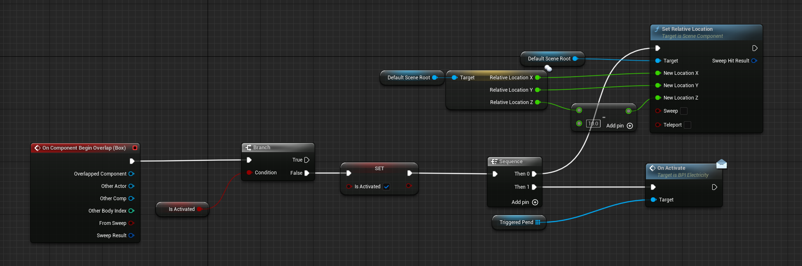

The "On Activate" node is what called the action of the pendulums.  Each pressure plate was given an array of pendulum BP or arrow BP to activate utizing a public array.  The array size was not specified so that each plate could trigger any amount of pendulums or arrows desired.  Here is a clip of the arrow traps in action.

In order to trigger health loss and also cause visible collision, for each trap two identical meshes layered on top of each other were utilized. One set blocked all collisions, while the other overlapped all.

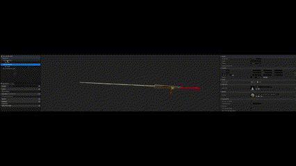

The elevators that you can activate to go both up and down made use of timelines to control the animations, but were triggered in the same way that the traps were triggerd.  The only difference was that the trigger was a switch in which the player needs to provide an input to activate.

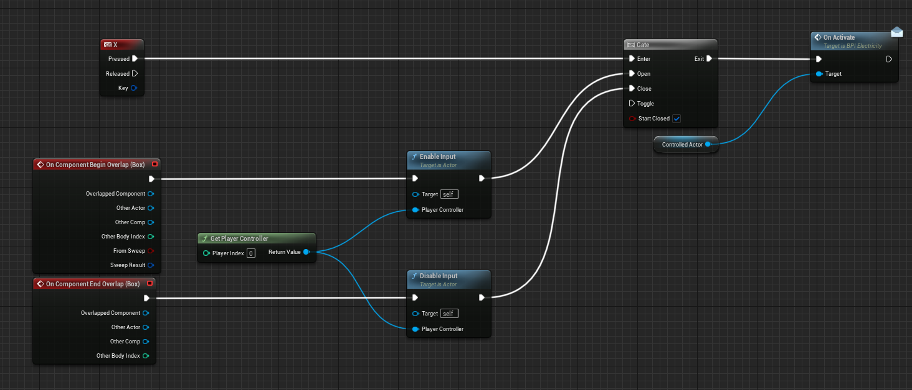

A gate was used so that the player must be within a certain range (outlined by a Box collider) and only enabled input when the character entered the box, but disabled input when they left.  Here is an example of both the elevator and pendulum traps being triggered.

## Collectables and Win Condition
The next task was to create a win condition as well as collectables that the player could pick up.  To encourage full play through of the level, I created collectables that the player needed four of in order to enable to final door (win condition) to be opened.  The collectables were created using a statue asset for the mesh, but then included some hovering text and a simple niagara system to make them stand out in the game.  Each collectable that was "picked up" would dissapear on pick up and then add one to the number of keys attained (controlled by the game mode called ThirdPersonGameMode).

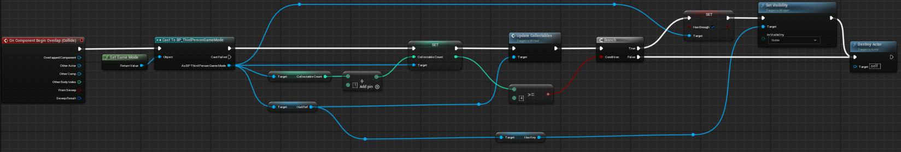

The win condition was a little tricky.  When the player entered the box collider trigger surrounding the door, the door needed to check for the amount of collectables.  The boolean "HasEnough" was set to true once the character picked up four collecatbles and set the visibility of the "Key Obtained" text in the HUD to visible only if it is true.  Once the door checked for the key and showed it was obtained, input was enabled and an ending sequence was set in motion.  The game then paused and the final Widget congratulating the character was displayed.

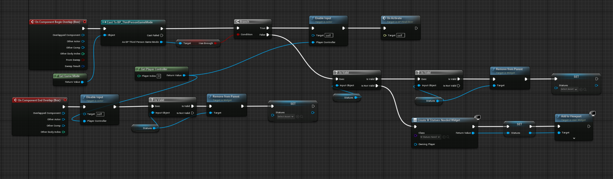

## Main Character
Probably my favorite part of the project was creating powers, different attacks, and a health system for the main character.  
### Powers
In a bit of personal creativity, I wanted the character to have mulitple powers.  Each power was brough upon by a different input.  To create the effects of each power, I utilized the fountain niagra system and used the mesh reproduction sprite and the base skeletal mesh of the character as the volume.  Then I created unique infinately spawning sprites that were based upon materials that looked like the powers (fire, ice, earth/grass, lightning).  In addition, the player was overlayed by a system of materials that utliezed the panner node to create the appearane that the caharacter was engulfed by their powers. Here are some examples of the niagara system and material set ups.

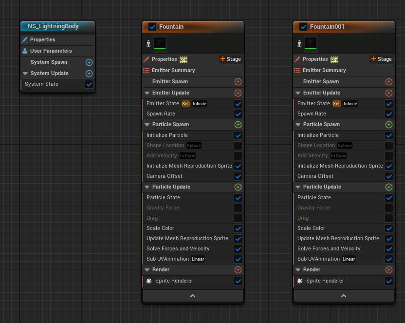

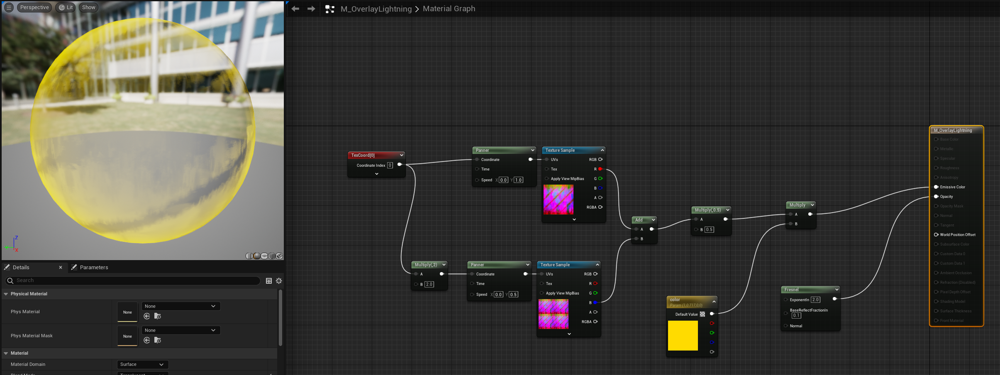

One of the challenges of this system was to make sure that the powers were never activated at the same time because it would eat so much memory.  I created a boolean for each power and with each input checked to ensure neither of the other powers were activated using an OR node.  A simple FlipFlop node made sure that I could deactivate the powers to reset the boolean and stop the niagra system before I could activate a different power.  

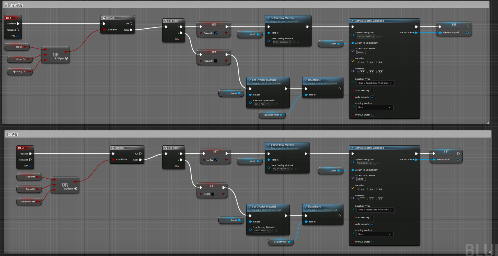

The project timeline was two weeks, and if I had a bit longer I would have created animations to go with each powerups. 

### Attacks
A cool trick I implemented was allowing the character to use the same attack button to launch a projectile, but he could only do it once his powers were activated, and the projectile was different for each power.  For example, fire launged a fireball, ice launched an ice Spear, Earth launched a grass blade (a mesh I had to create myself), and lightning launched essentially a thunderball.  The trick was simple, utilizing the same booleans for the power ups, a series of branches check which power was activated and spawned a different BP from the same location and with the same force. The trick to these (as well as the arrow traps) in order to fly straight was to disable the gravity for each BP.

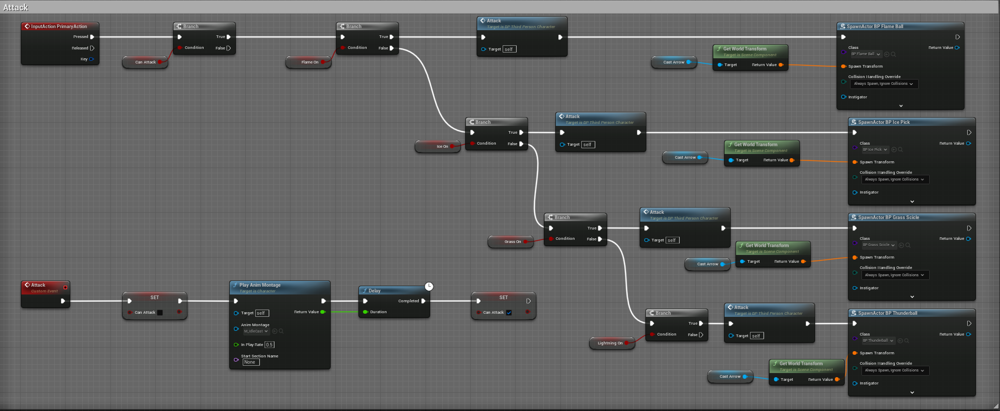

I had to move the cast arrow out in front of the character enough so that it looked like the character threw the projectile (using a self-created animation) and becuase each one applied damage on collision, so the player wouldn't deplete his own health.

### Player Health/Hud

A widget that was called on start acted as the HUD for the game. Along with the number of collectables attained, it also had the counter for the player lives and the health bar for the character.  Since there were an absurd number of ways that the player took damage (fall damage, trap damage, NPC and Boss attacks) I also create a regeneration system that slowly refilled the character health overtime.

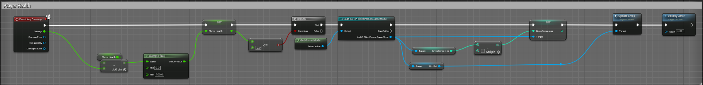

A simple clamp to ensure the player only took enough damage to lose one life was utilized as well as a cast to the game mode to update the lives if he was killed.  The health bar was created using a progress bar component and tied to a function called "GetPercent" that was regularly pulling the Health of the character.  The player's life was set to 100, and so all that needed to be included to ensure the bar was correct was a simple division by 100, but this could have easily been modified to the player's max health if a leveling system were implemented.

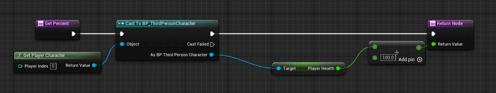

## AI/NPC and Boss
The most time consuming part of this project was AI and Boss behavior.  I tried multiple ways of creating AI behavior, including behavior trees.  A lot of bugs came up that needed finessing and there just was not enough time to find and adjust them all.  So, in order to create that NPC feel, I ended up scripting the behaviors directly into the AI BP.  The first thing I did was create a NavMesh in each area I inteded to have an NPC.

Once I had those baked the way I wanted by limiting or expanding the depth, I implented the Patrol behavior. This was done primarily using the node "GetRandomReachablePointInRadius", and I essentially created a loop in which the character was constanly iterating to the next point within his range on the NavMesh.  While this is not the cleanest method, it worked for the project's purpose.

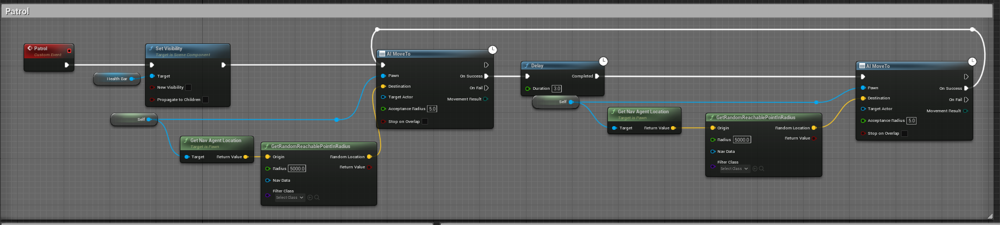

Next I used pawn sensing through sight to initiate a custom follow event.  Once the AI sensed the player, they would move to their position constantly.  I had to lower the AI run speed to ensure that the character would be able to get away, otherwise that would be too oppressive.  Using a "canAttack" boolean, once the AI was withing a reasonable range of the player, he would begin attacking the player.  If the player moved out of range, the AI Move To node would fail, so I had the NPC beging the Patrol function again.

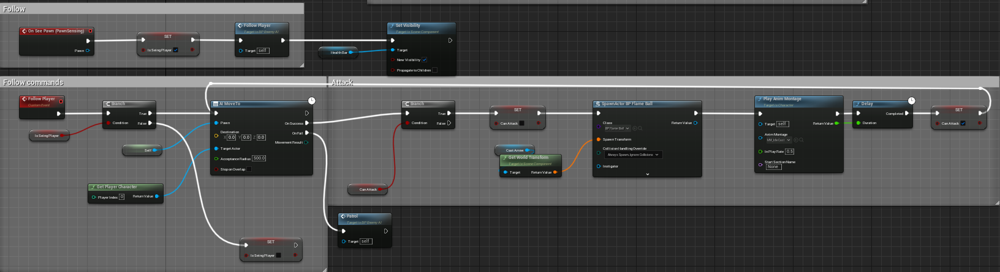

Here you can see an example of how this plays out in the game.

Some cool features of the NPC are that there is no actual skeletal mesh present, but rather it is a combination of an overaly material with a panner and the same niagra system for the fire powers.  This was a creative decision because the level was in the desert and so fighting essentially a Sun diety seemed like a good fit.  In addition, the NPC is also launching the same fireball that the player can launch, this was for efficiency as well as fitting the back story of the main character being a demi-god fighting against a deity from whom his powers originated.  The NPC and Boss all used the same animations as the character, and to create the casting effect, I personally went in and frame by frame adapted the current animations using the sequencer tool.  The problem was the legs were not matching well, so what I did was use a "Layered Blend per Bone" node and cached poses to blend my updated animation with the normal character movemnts.  Here is the anim graph that both the NPC and the player character used.

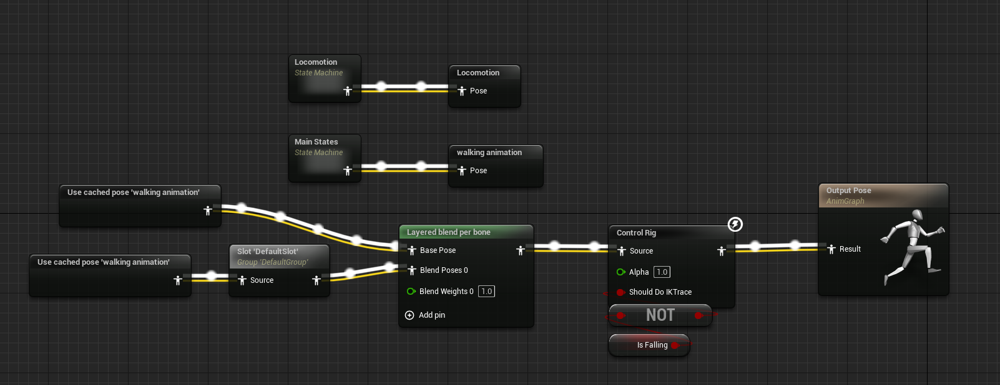

Another thing I am pleased with is the health bar connected to the NPC.  This was done by creating a progress bar component above each NPC and applied the UI to Screen instead of World.  This made the size managable and always mad the health bar face the game screen.  The clever trick to make it not constantly visible, even when in another room, was disabling the visibility upon instantiation of the NPC.  Then, change the visibility to active once the NPC either saw the player, or by capsule component collision.  This was done for the purpose of only being made visible during engagement.

### Boss
The final level boss was essentially an enlarged NPC with customized pawn sensing range and speed.  The biggest differences were the health bar was actually a completely new UI element and was only called with the Boss spawns, and the direction of attack. Since the boss was so much bigger, the biggest issue was he could never attack the player because the "cast arrow" was always facing directly forward, meaning he always cast too high and missed the player. To fix this, I adusted the cast arrow to rotate in the direction of the player once he was seen.  It took a few tries to get it right, but a simple "Find Look at Rotation" node ended up doing the trick.

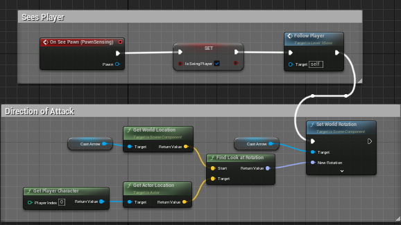

Another key difference was the spawn.  To spawn the Boss, I created a large trigger box around the last collectable needed.  This meant that the Boss spawned before it could be reached.  The cool feature that was added though, was that once the Boss spawned, the Sun dissappeared and the global illumination was affected.  This was created within the Level blueprint using a "Do Once" node so that the sun would not just keep spinning around and around.

Here is the overall effect created by this.  Keep in mind, the graphics were scaled down for construction purposes, and on a system with a high functioning GPU, the effect is far more daunting.

https://github.com/Keefer184/LostAdventure/assets/136768491/e9040159-eb88-40bf-ae86-e56a2c5c823c

## Other Features
Other features that were implemented simply for a more game like feel were the graduated fall damage system, the opening scene and control menu, and the flashlight orb.

The fall damage system was done by applying an "Event OnMovementChange" node that intialized while the character was in the falling state.  Using a retriggerable delay, the damage escalated after a set amount of time in the air.  This simply calculated the total damage to be done, but then an "Event OnLand" node is when the actual damage was applied.

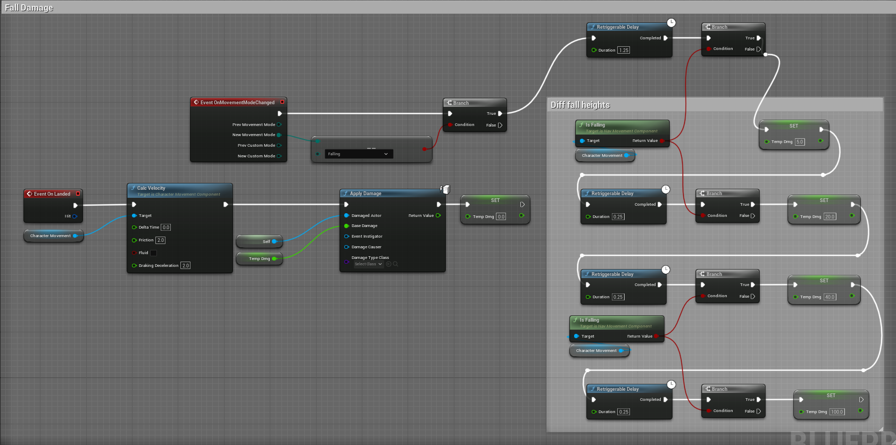

The controls and opening scene were more for aesthetics that brought intrigue and created more playability.  Since there were so many controls, I needed a reference guide for the players.  The control scene could be accessed at both the opening scene and in the pause menu in the main scene.  It was accessible through a button in each scene.

The flashlight orb was called with a simple input and flip flop node.

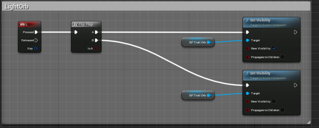

It was created using a niagra system similar to the powers, but using a sphere as the mesh instead of the skeletal mesh.  The materials used were emmissive materials, so when there were no lights, it provided a small personal lighting system that would follow the character.  It was a component attached to the character and was triggered by simply setting its visibility.
